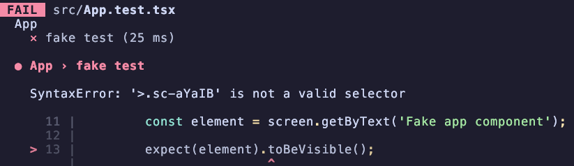

# nwsapi reproduction problem

This repository contains reproduction for a problem with `nwsapi@2.10.0`.



## Reproduction

1. Clone the repository
2. Install dependency

```bash
yarn
```

3. Launch test

```bash
yarn test
```


4. See the error in your terminal


## When?

This error appears in version `nwsapi@2.10.0`.

> I have created a `working` branch where I fix the version to `2.9.0`. And you can it works.

